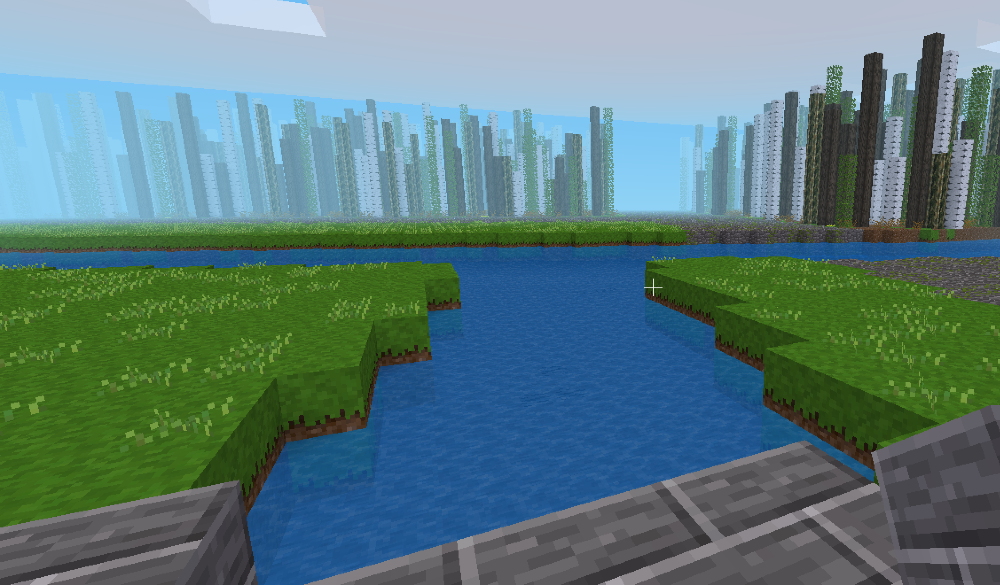

# Fasnacht 2021

It is February in Basel. The woods of Lange Erlen should be full of pipers, drummers and Guggenmusik bands practising for Fasnacht. But instead, they are silent.

As a response to this, I turned to [Minetest](https://www.minetest.net/). My aim was to create a world which captured something of those woodland Fasnacht practice sessions. Which first means making some wintery woods with a river and some streams.

Since night somehow feels more fasnachty than day, the woods are designed for viewing in the in-game night. That means we need some light. I took inspiration from the lanterns carried by the pipers during Morgenstraich. But instead of being carried by people, they just randomly sit around. So the woods also have the feeling of an aboandoned Morgenstraich. Seems fitting for the COVID-19 era.

Since I started borrowing elements from actual Fasnacht, rather than just the practice sessions, I decided to put some of the larger lanterns in too. I may have gone slightly overboard with the nyancats.

The world was created in Minetest 5.3.0 and can be found in `fasnacht.zip`. Just unzip and put it in your worlds folder. Note that the nyancat mod is required.

Also note that music is not included, but it is a very important part of the experience. So you'll need some on in the background. There is a bunch [here on YouTube](https://www.youtube.com/results?search_query=basler+fasnacht) for example.

The woods were designed in 'fasnacht.png', and then turned by 'fasnacht.ipynb' into a specification for Minetest blocks in 'blocks.csv'. Using the [csv2terrain](https://github.com/quantumjim/csv2terrain) mod, this can then be turned into a Mintest world.

